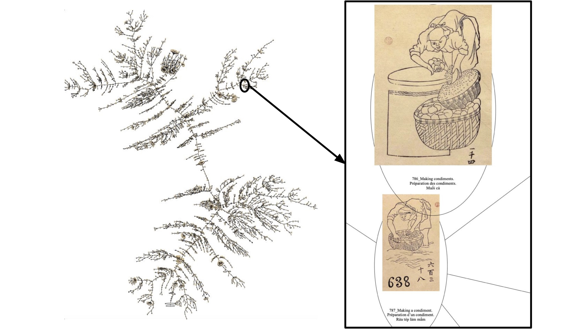

# Social Worlds
*Visualization code and starter data for exploring connections in captioned image corpora.*

<p align="left">
  <a href="https://doi.org/10.1109/MCG.2026.3660122">
    
  </a>
  <a href="https://osf.io/zpr8c/overview">
    
  </a>
  <a href="https://youtu.be/CKkZ1sL8y68">
    
  </a>
</p>

This repository open-sources tools used to generate visualizations in *Visual Exploration of a Historical Vietnamese Corpus of Captioned Drawings: A Case Study*.

<p align="center">
  
</p>

## Package Layout
- Source package: `src/social_worlds/`
- Build config: `pyproject.toml`
- CLI pipeline commands: `sw-similarity`, `sw-dr`, `sw-pixplot-export`, `sw-reorder`, `sw-enrich`, `sw-mst`, `sw-cluster`, `sw-radial`

## Requirements
- Python 3.9+
- Graphviz system package (required by `pygraphviz` for MST rendering)

## Installation
```bash
python3 -m venv .venv
source .venv/bin/activate
pip install --upgrade pip
pip install -e ".[dr]"
```

## Data Inputs
1. Download the compiled sheet (Excel):
   [Final Compiled Captions Sheet](https://docs.google.com/spreadsheets/d/16yMkE7Mq18QrLiFVpHl8XWvVdxIKrZy8/edit?usp=sharing&ouid=107527649313550538089&rtpof=true&sd=true)
2. Download images ZIP:
   [Image Archive](https://drive.google.com/file/d/10gt402_PHWq2Q_trCCoWJQYXRksBGYBg/view?usp=sharing)
3. Unzip images into `web_low_res/` (or pass a custom path to `sw-mst --images-dir`).

## Quickstart Pipeline
Set your sheet path once:

```bash
SHEET_PATH="/absolute/path/to/Final_Compiled_Captions.xlsx"
COLOR_COL="9a. Gender: Gendered based on Captions"
```

1. Generate similarity matrices:
```bash
sw-similarity \
  --sheet "$SHEET_PATH" \
  --sheet-tab Sheet1 \
  --output-dir . \
  --embedding-metadata-cols "$COLOR_COL"
```

2. Generate t-SNE coordinates from embedding matrix:
```bash
sw-dr \
  --input english/english_mpnet_embedding_matrix.csv \
  --method tsne \
  --output english/tsne_coords.csv \
  --plot english/tsne_projection.pdf \
  --annotate \
  --color-col "$COLOR_COL"
```

3. Reorder matrices:
```bash
sw-reorder --base-dir . --method average
```

4. Attach multilingual metadata and image links:
```bash
sw-enrich --sheet "$SHEET_PATH" --sheet-tab Sheet1 --base-dir .
```

5. Render MST (English default):
```bash
sw-mst --input english/english_4454.csv --images-dir web_low_res --output english/english_mst.pdf
```

6. Generate hierarchical clustering dendrogram:
```bash
sw-cluster --input english/english_4454.csv --output english/hierarchical_clustering.pdf
```

7. Generate radial JSON:
```bash
sw-radial \
  --input english/english_4454.csv \
  --keyword "A praying monk (earthenware toy)." \
  --output radial.json
```

Upload `radial.json` to [this Observable notebook](https://observablehq.com/d/c7cbeabbeffbc1c2) to view the radial tree.

## Dimension Reduction
The paper uses both t-SNE and UMAP. `sw-dr` supports both methods and writes 2D coordinates to CSV (and optional JSON/plot output).

Input contract for `sw-dr`:
- CSV with an `id` column and a `label` column
- Embedding feature columns beginning at `--feature-start-col` (auto-detected from `feat_` by default)
- Optional categorical column for colors via `--color-col`

By default, `sw-similarity` now writes embedding matrix files compatible with `sw-dr`:
- `english/english_mpnet_embedding_matrix.csv`
- `french/french_mpnet_embedding_matrix.csv`
- `viet/viet_sbert_embedding_matrix.csv`

To color points by a label/group column (for example gender), include that column during embedding export:
```bash
sw-similarity --sheet "$SHEET_PATH" --output-dir . --embedding-metadata-cols "$COLOR_COL"
```
For your current workbook, use:
```bash
COLOR_COL="9a. Gender: Gendered based on Captions"
```
If your sheet changes, replace with the exact header.
To inspect available sheet headers:
```bash
python3 - <<'PY'
import pandas as pd
import os
sheet = os.environ["SHEET_PATH"]
print(pd.read_excel(sheet, sheet_name="Sheet1", nrows=1).columns.tolist())
PY
```

t-SNE example:
```bash
sw-dr --input english/english_mpnet_embedding_matrix.csv --method tsne --output english/tsne_coords.csv --annotate --color-col "$COLOR_COL"
```

Paper-style dense-label example (cleaner large canvas):
```bash
sw-dr \
  --input english/english_mpnet_embedding_matrix.csv \
  --method tsne \
  --output english/tsne_coords.csv \
  --plot english/tsne_projection.pdf \
  --annotate \
  --color-col "$COLOR_COL" \
  --fig-width 100 --fig-height 100 --dpi 200 \
  --point-size 100 --label-fontsize 3 \
  --max-annotations 0
```

UMAP example:
```bash
sw-dr --input english/english_mpnet_embedding_matrix.csv --method umap --output english/umap_coords.csv --standardize
```

## Additional Visualization Method
The paper also includes a PixPlot-based visualization workflow.

- PixPlot repository: [pleonard212/pix-plot](https://github.com/pleonard212/pix-plot)

Export `sw-dr` output to PixPlot-ready files:
```bash
sw-pixplot-export \
  --dr-input english/tsne_coords.csv \
  --metadata-output pixplot/metadata.csv \
  --layout-output pixplot/layout.json \
  --manifest-output pixplot/manifest.txt \
  --image-dir web_low_res
```

This produces:
- `pixplot/metadata.csv` with `filename`, `label`, `category`, `description`, `x`, `y`
- `pixplot/layout.json` as `[[x, y], ...]`
- `pixplot/manifest.txt` image list for PixPlot `--images`

## Make Targets
After installation, the same pipeline is available via:

```bash
make similarity SHEET="$SHEET_PATH"
make reorder
make enrich SHEET="$SHEET_PATH"
make mst
make cluster
make radial
make dr
make pixplot-export
```

Or run everything:

```bash
make pipeline SHEET="$SHEET_PATH"
```

## Video
- IEEE CG&A talk: [Visual Exploration of a Historical Vietnamese Corpus of Captioned Drawings: A Case Study](https://youtu.be/CKkZ1sL8y68)
- Channel: IEEE Computer Society

## Citation
If you use this code, please cite the paper:

```bibtex
@article{fu2026visual,
  title={Visual Exploration of a Historical Vietnamese Corpus of Captioned Drawings: A Case Study},
  author={Fu, Kailiang and Gurth, Tyler and Laidlaw, David H. and Nguyen, Cindy Anh},
  journal={IEEE Computer Graphics and Applications},
  year={2026},
  doi={10.1109/MCG.2026.3660122}
}
```

## License
MIT. See [LICENSE](LICENSE).
